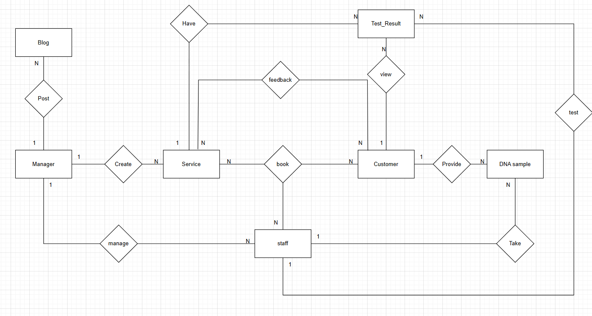

## 	User Requirements
2.1	Guest
-	Goal: 	
	+ Learn about the services available on the system
+ Register an account to use the service
-	Task:
+  View information about different types of DNA tests
+  Schedule a consultation and communicate with staff
+  Enter user information to register
2.2	Customer:
-	Goal:
+  Register for DNA testing services
+  Track the testing progress
+  View test results
+  Manage profile and history
-	Staff
+  Select the type of test, sample collection method, fill in information, and schedule an appointment
+  View sample processing status and notifications from the system
+  Log in and access the test results section
+  View, update profile, and look up test history
+  Rate the service
2.3	Staff:
-	Goal:
+  Perform tasks related to sample collection and DNA testing
+  Enter data and manage customer information/test results
+  Provide consultation to customers
-	Task:
+  Add, edit, and search for customer information
+  Create consultation and testing appointments
+  View the list of customer sample collection appointments
+  Update the testing progress status
+  Enter test results into the system
+  Respond to customer questions or support requests via the system
2.4	Manager:
-	Goal:
+  Ensure the testing process is carried out on schedule and with high quality
+  Enhance customer experience through managing feedback and reviews
+  Monitor the operational efficiency of the testing service at the facility
+  Manage testing services (pricing, procedures, service information)
-	Task:
+  Monitor the progress of each DNA test case at the medical facility
+  Review test results uploaded to the system
+  View and analyze customer feedback
+  Manage testing service information: update descriptions, pricing, and procedures
+  Access dashboards and reports to evaluate overall operations
2.5	Admin:
-	Goal:
+  Administer the entire DNA testing software system of the medical facility
+  Ensure the system operates stably and is properly configured
+  Manage users and assign appropriate access permissions
+  Monitor and support other departments during system operations
-	Task:
+  Configure the system, including the homepage, service list, and user guides
+  Manage system users: create, edit, and delete accounts (Guest, Customer, Staff, Manager)
+  Assign usage rights and restrict functionalities according to each user type
+  Monitor and oversee the entire testing process within the system
+  View and export overall system statistics from the Dashboard

## Concept Diagram

📊 [Xem sơ đồ hệ thống trên Draw.io](https://app.diagrams.net/#G1SKFOfrTQoccVk-UzYPPtAwg7NVrxOUnJ#%7B%22pageId%22%3A%22a6mbGnwGvX9pmkE2TlM8%22%7D)

